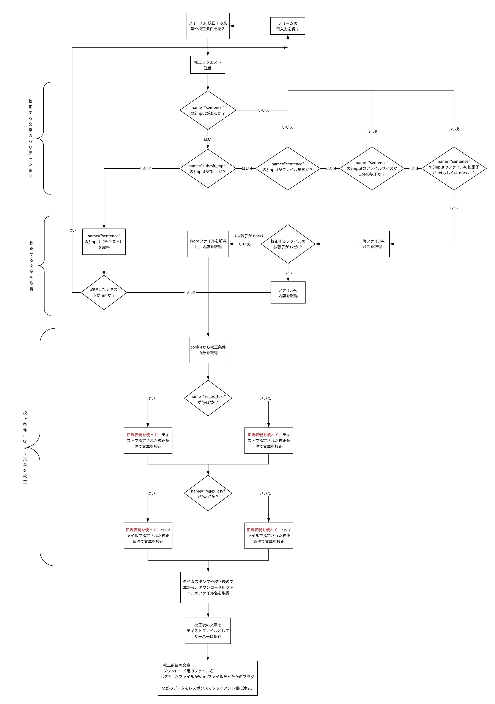

# 自動校正サービス

## サービスの概要
「校正する文章」と「校正の条件」を指定することで、**自動で文章を校正**してくれるサービス。
校正された文章はブラウザで表示されるほか、１クリックでコピーしたり、ファイル形式で受け取ることができる。

## 校正処理の流れ

## 機能一覧
### 校正する文章と校正条件をPOSTリクエスト
- 校正する文章の提出
    - **textareaに手打ち**するか、**txtもしくはdocxファイルをアップロード**することで指定できる。
    - 提出形式の切り替えは、jQueryを利用してタブ形式で表示している。
- 校正条件の提出
    - 「変更前の文字列→変更後の文字列」形式で、**inputに手打ち入力**もしくは**csvファイルをアップロード**することで指定できる。
    - チェックボックスで正規表現を使うかどうかを指定できる。

### 校正する文章の入力形式をバリデーション
- **校正する文章が提出されているか**チェック
- ファイル形式で提出された場合
    - **拡張子がtxtもしくはdocxのファイルか**チェック
     ※docxの場合はPHPWordを使って文章を取得
    - ファイルサイズが1.5MB以下かチェック
- テキスト形式で提出された場合
    - テキストが空欄でないかチェック

### 校正条件に従って文章を校正
- inputに手打ち入力された条件で校正
    - **正規表現**を使う指定があれば、正規表現で文章を置換する。
- 提出されたcsvファイルの条件で校正
    - **正規表現**を使う指定があれば、正規表現で文章を置換する。

### 校正後の文章をブラウザで表示&ファイルをダウンロード
- ブラウザで表示
    - 校正前の文章と校正後の文章を並べて表示。
    - **校正された箇所が分かるように**、置換された文字には色を付ける。
- １クリックで校正後の文章をコピー
- １クリックで校正後の文章を**ファイル形式でダウンロード**
    - 校正する文章が、textareaに入力もしくはtxtファイルをアップロードされていたらtxtファイルでダウンロードされる。
    - 校正する文章が、docxファイルでアップロードされてされていたらdocxファイルでダウンロードされる。
